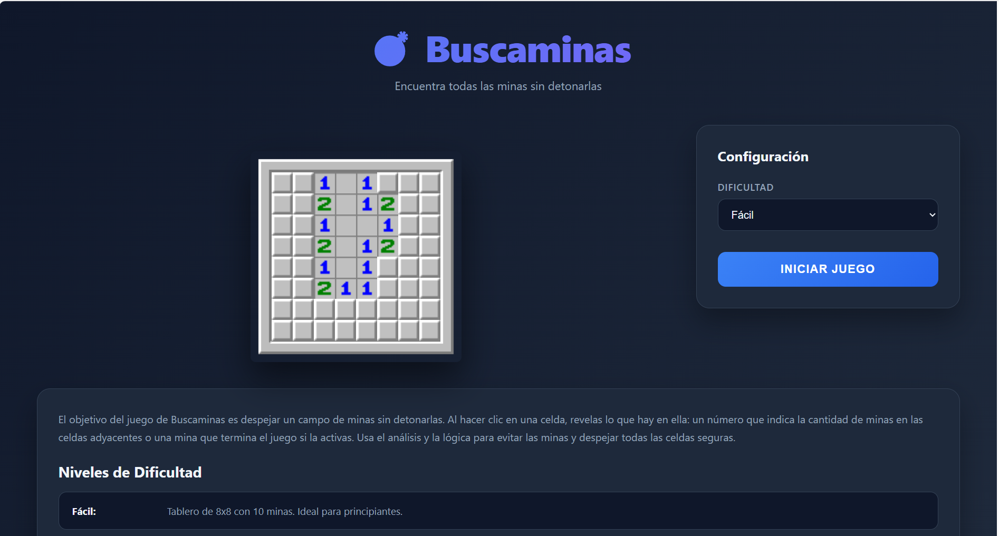
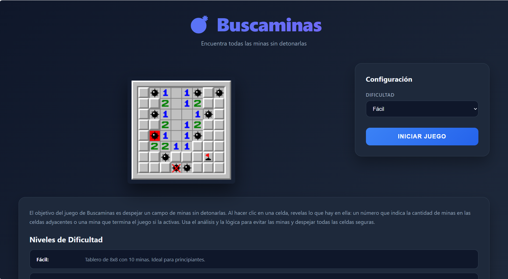

# Mineskeeper (HTML, JS, CSS)

A lightweight, browser-based Mineskeeper (Minesweeper) game built with plain HTML, JavaScript and CSS. Play classic Minesweeper in your browser — no build tools required.

Features
- Classic Minesweeper gameplay: reveal tiles, place flags, win/lose conditions.
- Multiple difficulties / configurable board size and mine count.
- Timer and mine counter.
- Responsive layout for desktop and mobile.
- No dependencies — single-page app using HTML/CSS/JS.

Quick demo
- Open `index.html` in your browser.
- Or serve the folder with a static server (e.g., `npx http-server` or `python -m http.server`) and navigate to `http://localhost:8080`.

How to play
- Left-click (or tap) a cell to reveal it.
- Right-click (or long-press / two-finger tap on mobile) to toggle a flag on a suspected mine.
- Reveal all non-mine cells to win. Revealing a mine ends the game.
- Numbers show how many mines are adjacent to that cell.

Controls
- Mouse: left-click to reveal, right-click to flag.
- Touch: tap to reveal, long-press to flag (or use the flag button if available in UI).
- Buttons:
  - New Game / Reset: start a new board.
  - Difficulty: choose preset difficulty or custom size/mines.

- Game board (start)

- Game board (in play)

- Game over (revealed mines)

If you don't have images yet, remove the image lines or add your own paths (e.g. `screenshots/`).

Project structure (typical)
- index.html — main game page
- src/ or js/ — JavaScript game logic
- css/ — styles
- assets/ — icons, screenshots, optional images

Customization
- Change default board sizes or mine counts in the JS configuration.
- Tweak visuals in the CSS (colors, cell size, animations).
- Add keyboard shortcuts or enhanced accessibility as improvements.

Contributing
- Bug reports, suggestions and PRs are welcome.
- Please open an issue describing the problem or desired change before submitting larger PRs.

License
- MIT License — feel free to use and modify for personal or educational projects.

Author
- pumpkinnlatte

Enjoy the game!
